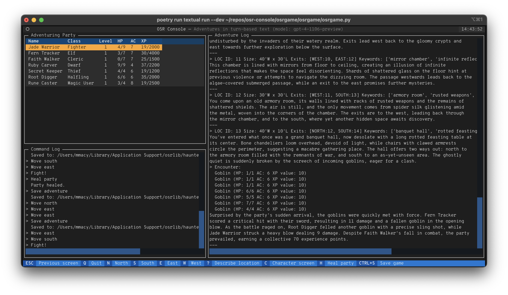

# OSR Console: Adventures in turn-based text

OSR Console is an SDK for a turn-based dungeon crawler RPG in the Old-School Renaissance (OSR) style for your terminal. The SDK's main library, `osrlib`, is written in Python, as is the example user interface which uses the [Textual](https://textual.textualize.io/) TUI framework.

## Prerequisites

- [Python](https://www.python.org/) 3.11+
- [Poetry](https://python-poetry.org/) 1.6+
- [OpenAI API](https://platform.openai.com/docs/) key (if you enable AI-generated dungeon location and encounter descriptions)

## Installation

This monorepo houses three projects: the game's library, `osrlib`, that library's `tests`, and an example user interface, `osrgame`.

For more information about each, see their respective `README.md` files:

- [osrlib](osrlib/README.md) - Python library for OSR-style turn-based RPGs
- [osrgame](osrgame/README.md) - Textual TUI demonstrating use of `osrlib`
- [tests](tests/README.md) - pytest-based unit and integration tests for `osrlib`

## Usage of AI

A game based on the `osrlib` library can optionally leverage AI to generate text content. In the current implementation, if you have an OpenAI API key, you can have one of their GPT models like `gpt-3.5` or `gpt-4-turbo` generate dungeon location descriptions, encounter battle summaries, and adventure session summaries at runtime.

**The use of AI is entirely optional.** Enabling the creation and play-through of hand-crafted-by-a-human adventures was the original intended use case for the `osrlib` library, and that intent remains.

OpenAI's language models, however, are proving useful in testing the library and for experimentating with using an LLM as a real-time(ish) game content generator. The library acts as the rules engine while the language model produces the long-form content for room descriptions and adventure log-type stuff.

It's also just plain fascinating to see what the LLM comes up with for location descriptions in an auto-generated test dungeon. Provided with only an adventure name and a few sentences for an intro, you can have `osrlib` populate a random dungeon with 'n' locations and then have the language model generate keywords for those locations. Then, as the player moves their party through the dungeon, you can have the LLM generate a location description on-the-fly from the location's keywords.

This screenshot shows an example of LLM-generated content in the (very much *for testing purposes only*) exploration [screen](https://textual.textualize.io/guide/screens/) in `osrgame`, the sample Textual-based TUI:

## Usage

:pencil: TODO :pencil:

## Contribute

:pencil: TODO :pencil:

## License

[MIT License](LICENSE) for now.

## Credits

- Project owner: [@mmacy](https://github.com/mmacy)
- Game rules and mechanics heavily inspired by TSR's 1981 versions of the Dungeons & Dragons Basic and Expert sets, or *D&D B/X*.
